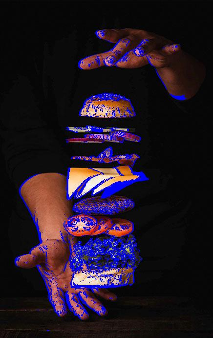
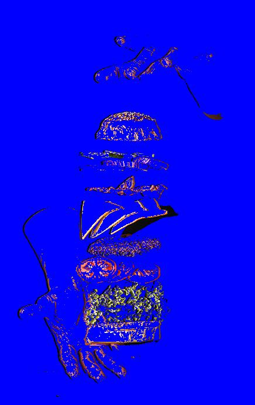

# Simple Image Diff Checker
Simple implementation of an Image difference checker.

##Pending Extensions
### Improving pixel difference function
Right now we are using Manhattan distance, we may want to explore alternatives that better reflect difference in color.

### Image alignment
Evaluate ways to improve alignment for misaligned input images.

### Non comforming image shapes
Related to the previous point. For input images with different sizes explore ways to align and compare intersection.

##Build
```
go build
```

##Run
###Print help
```
./simple-image-diff-checker -h
```

###Example execution
```
./simple-image-diff-checker -in1 images/diff-1.jpg -in2 images/diff-2.jpg -out1 images/out-1.jpg -out2 images/out-2.jpg -r 10 -g 10 -b 255 -a 1
```

Image 1 | Image 2
--------|---------
|

Output 1 | Output 2
--------|---------
|
